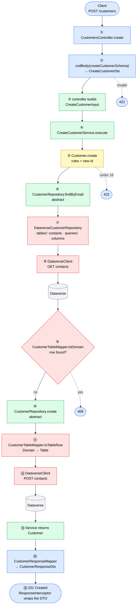
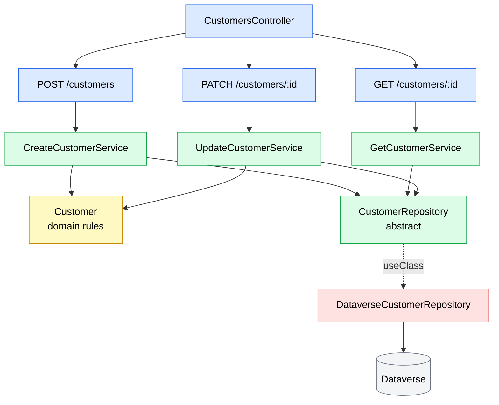
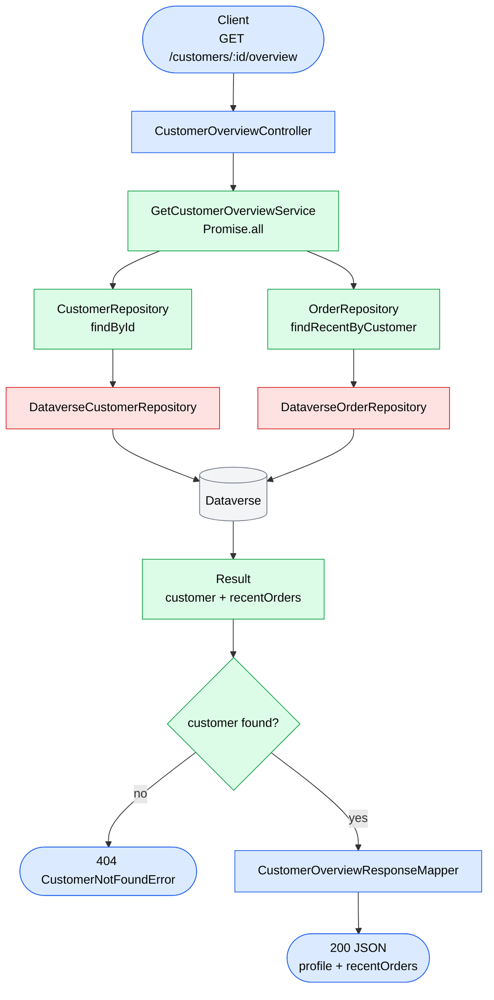
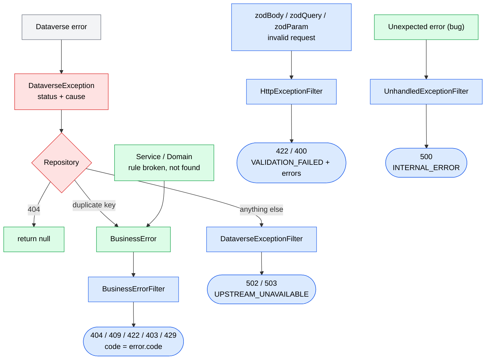

# Request Flow

Color = folder: 🟦 controllers / dto / mappers · 🟩 services / abstract repository · 🟨 domain · 🟥 repositories/dataverse · ⬜ Dataverse

## 1. Main flow: `POST /customers`



Folder for each step: [structure.md → section 0](structure.md#0-request-steps-through-the-folders-post-customers). Code: [section 5](#5-the-same-flow-as-code).

## 2. One feature, many services

Each endpoint calls one service. All of them share the same abstract repository.



## 3. One service, many repositories: `GET /customers/:id/overview`



## 4. Error flow



Every red/blue end box above is the same error envelope (`src/core/http/`):

```json
{ "success": false, "statusCode": 404, "code": "CUSTOMER_NOT_FOUND", "message": "…", "data": null }
```

A successful request is wrapped by `ResponseInterceptor` as `{ "success": true, "statusCode": 201, "message": "OK", "data": <response DTO> }`.

## 5. The same flow as code

Numbers match the steps above. Only the lines that matter are shown.

```ts
// ── controllers/customers.controller.ts ─────────────────────────── ① ③ ⑭ ⑮
@Post()
async create(
  @Body(zodBody(createCustomerSchema)) dto: CreateCustomerDto, // ② validated body
): Promise<CustomerResponseDto> {
  const input: CreateCustomerInput = {                          // ③ DTO → Input
    firstName: dto.firstName,
    lastName: dto.lastName,
    email: dto.email,
    birthDate: new Date(`${dto.birthDate}T00:00:00Z`),
  };
  const customer = await this.createCustomer.execute(input);    // ④ … ⑬
  return CustomerResponseMapper.toResponse(customer);           // ⑭ → ⑮ 201
}

// ── dto/create-customer.dto.ts ──────────────────────────────────── ②
export const createCustomerSchema = z.object({
  firstName: z.string().trim().min(1).max(50),
  lastName: z.string().trim().min(1).max(50),
  email: z.email().max(100),
  birthDate: z.iso.date(),
});
export type CreateCustomerDto = z.infer<typeof createCustomerSchema>;

// ── services/create-customer.input.ts ───────────────────────────── ③
export interface CreateCustomerInput {
  firstName: string;
  lastName: string;
  email: string;
  birthDate: Date;
}

// ── services/create-customer.service.ts ─────────────────────────── ④ … ⑬
async execute(input: CreateCustomerInput): Promise<Customer> {
  const customer = Customer.create({ id: randomUUID(), ...input }, new Date()); // ⑤

  const existing = await this.customers.findByEmail(customer.email);           // ⑥ ⑦ ⑧ ⑨
  if (existing) {
    throw new EmailAlreadyInUseError(customer.email);                          // ⑨ kind: Conflict
  }

  await this.customers.create(customer);                                       // ⑩ ⑪ ⑫
  return customer;                                                             // ⑬
}

// ── domain/models/customer.model.ts (inside class Customer) ─────── ⑤
static create(props: NewCustomerProps, today: Date): Customer {
  const customer = new Customer({ ...props, email: props.email.trim().toLowerCase(), status: CustomerStatus.Active });
  if (!customer.isAdultOn(today)) {
    throw new CustomerMustBeAdultError();                                      // kind: RuleViolation
  }
  return customer;
}

/** `today` is passed in (no hidden new Date()), so tests can use any date. */
isAdultOn(date: Date): boolean {
  if (!this.birthDate) {
    return false;
  }
  const eighteenthBirthday = new Date(this.birthDate);
  eighteenthBirthday.setUTCFullYear(eighteenthBirthday.getUTCFullYear() + 18);
  return eighteenthBirthday <= date;
}

// ── domain/enums/customer-error-code.enum.ts ────────────────────── ⑤ ⑨
export enum CustomerErrorCode {
  MustBeAdult = 'CUSTOMER_MUST_BE_ADULT',
  EmailAlreadyInUse = 'EMAIL_ALREADY_IN_USE',
}

// ── domain/errors/customer.errors.ts ────────────────────────────── ⑤ ⑨
// No HTTP here: only a kind + code. Each caller decides what to do with it.
export class CustomerMustBeAdultError extends BusinessError {
  readonly kind = BusinessErrorKind.RuleViolation;
  constructor() {
    super('Customer must be at least 18 years old', CustomerErrorCode.MustBeAdult);
  }
}

export class EmailAlreadyInUseError extends BusinessError {
  readonly kind = BusinessErrorKind.Conflict;
  constructor(email: string) {
    super(`Email ${email} is already in use`, CustomerErrorCode.EmailAlreadyInUse);
  }
}

// ── repositories/customer.repository.ts (abstract) ──────────────── ⑥ ⑩
export abstract class CustomerRepository {
  abstract findByEmail(email: string): Promise<Customer | null>;
  abstract create(customer: Customer): Promise<void>;
}

// ── repositories/dataverse/dataverse-customer.repository.ts ─────── ⑦ ⑧ ⑨ ⑪ ⑫
async findByEmail(email: string): Promise<Customer | null> {
  const [row] = await this.dataverse.retrieveMultiple<CustomerTableRow>( // ⑧ GET contacts
    CUSTOMER_TABLE,                                                      // ⑦ from tables/customer.table.ts
    { select: CUSTOMER_COLUMNS, filter: `emailaddress1 eq ${odataString(email)}`, top: 1 }, // ⑦ queries/customer.query.ts
  );
  return row ? CustomerTableMapper.toDomain(row) : null;                 // ⑨
}

async create(customer: Customer): Promise<void> {
  const row = CustomerTableMapper.toTableRow(customer);                  // ⑪
  await this.dataverse.create(CUSTOMER_TABLE, row);                      // ⑫ POST contacts
}

// ── mappers/customer-response.mapper.ts ─────────────────────────── ⑭
static toResponse(customer: Customer): CustomerResponseDto {
  return {
    id: customer.id,
    fullName: customer.fullName,
    email: customer.email,
    status: customer.status,
  };
}
```

**Who decides the HTTP status?** Not the domain or the service. They throw errors that carry only a `kind` and a `code`. The HTTP edge (`BusinessErrorFilter` in `core/http/filters/`) maps the `kind` to a status. Another caller, like a CLI, catches the same error and handles it its own way:

| `kind` | HTTP (`BusinessErrorFilter`) | CLI (example) |
| --- | --- | --- |
| `RuleViolation` | 422 | print message, exit 1 |
| `Conflict` | 409 | print message, exit 1 |
| `NotFound` | 404 | print message, exit 1 |
| `Forbidden` | 403 | print message, exit 1 |

`201` in the controller is fine: the controller *is* the HTTP layer.
